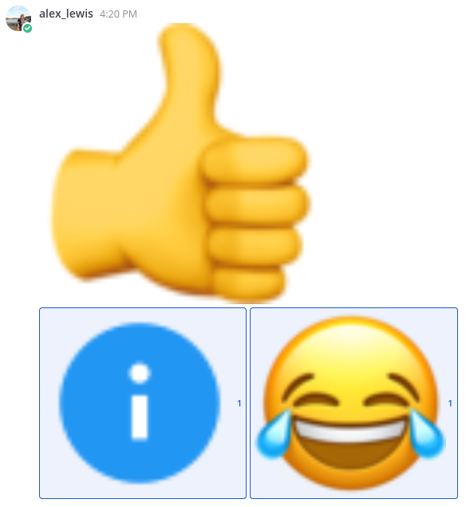
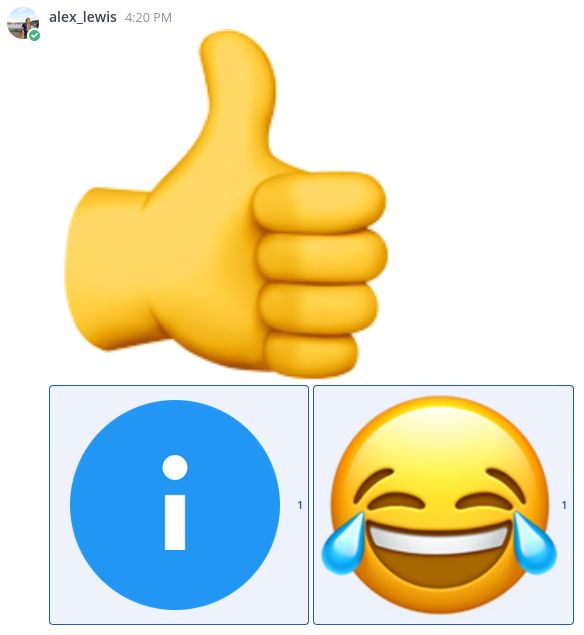

# High Resolution Mattermost Emojis

This browser extension makes all the default and some of the custom emojis higher relolution by intercepting requests and substituting local higher res images. This is made for Channable's instance of mattermost but can be easily adapted for other instances by only editing the urls in the manifest files.

This works better when emojis are being displayed at a larger size than normal.

| Before                       | After                      |
| -                            | -                          |
|  |  |

## Installation
Some custom emojis; contain peoples faces, are internal memes, or for other reasons should not be included in this public repository.

For this reason the zip containing the Firefox and Chrome extension (with all custom emojis) will be hosted on [Google drive](https://drive.google.com/drive/folders/1yqfTpCY2Z06wUSGIFchjgLNczIx0GJcx), you must download the extension from there.

You also need to clear your cache after installing the extension.

## To install on Chrome
1. Download the .zip from the [Google drive folder](https://drive.google.com/drive/folders/1yqfTpCY2Z06wUSGIFchjgLNczIx0GJcx)
2. Extract the zip
3. Go to chrome://extensions/
4. Enable development mode
5. Load unpacked extension open the folder that the zip was extracted to.

## Firefox
1. Download the .xpi from the [Google drive folder](https://drive.google.com/drive/folders/1yqfTpCY2Z06wUSGIFchjgLNczIx0GJcx)
2. Double click/open the .xpi in Firefox
3. Accept by clicking "Add"
4. On Mattermost click `ctrl` + `shift` + `r` to refresh clearing the local cache

## For development

`static_rules.json` is git ignored because it is a generated file.

## Getting high resolution default (Apple) emojis
1. Have mattermost downloaded (and unpacked)
2. Change `MATTERMOST_GIT_DIRECTORY` to where you unpacked mattermost.
3. `python get_high_resolution_emojis.py`

Note: Some emojis may be not found

## Generating new static rules
This must be done when adding or removing any emojis.

1. `python generate_static_rules.py`

## Package for Firefox
1. Generate static rules: `python generate_static_rules.py`
2. `zip -r -FS ../high-resolution-mattermost-emojis-firefox.zip * --exclude '*.git*' 'manifest.json' '*.py' '_metadata/*'`
3. Rename the manifest file in the zip
4. `printf "@ manifest-firefox.json\n@=manifest.json\n" | zipnote -w ../high-resolution-mattermost-emojis-firefox.zip`
5. Upload to https://addons.mozilla.org/en-US/developers/addons
6. Download signed .xpi
7. Rename the .xpi and upload to the [Google drive folder](https://drive.google.com/drive/folders/1yqfTpCY2Z06wUSGIFchjgLNczIx0GJcx).

## Package for Chrome
1. Generate static rules: `python generate_static_rules.py`
2. `zip -r -FS ../high-resolution-mattermost-emojis-chrome.zip * --exclude '*.git*' 'manifest-firefox.json' '*.py' '_metadata/*'`
3. Rename and upload to the [Google drive folder](https://drive.google.com/drive/folders/1yqfTpCY2Z06wUSGIFchjgLNczIx0GJcx).
